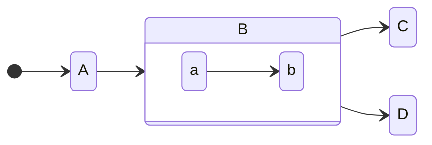
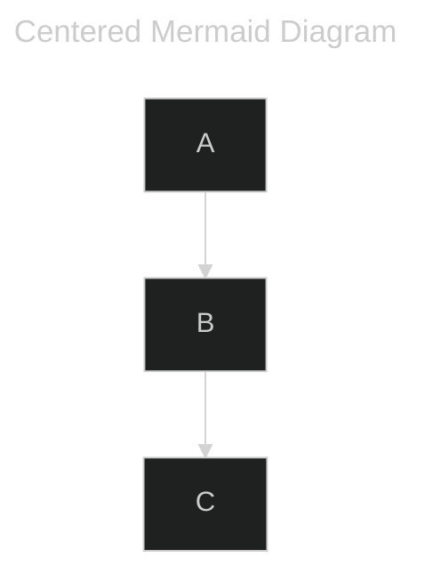

+++
title = 'First'
date = 2024-08-19T14:33:47+08:00
tags = ["first_tag"]
series = ["first_series"]
categories = ["first_cats"]
+++


Hello, this is some code block

```python
print("hello world!")
```





