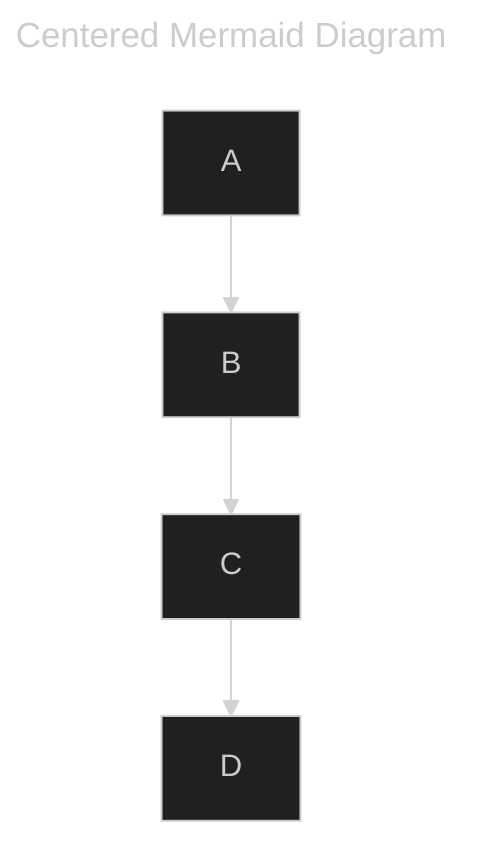

+++
title = 'Blog 開張!'
date = 2024-08-22T14:10:09+08:00
tags = ["Hugo"]
categories = ["Blog"]
+++


# 前言

想搞個 blog 紀錄點東西很久了，常聽說的架站工具至少有 `WordPress`、`Hexo`、`Hugo`等。

久未開始動手的主因之一，就是感覺這些東西安裝起來應該會佔不少空間，尤其是 `WordPress`，要裝資料庫又要裝網頁伺服器等等，對於只用一台小筆電以及不想租用雲端主機的我而言，
顯然不適合。

又如 `Hexo`，看起來是要安裝 `Node.js` 才能用， 而 `Node.js` 是一套完整的框架，為了架個 blog 安裝一個框架，跟 `WordPress` 一樣使人感覺臃腫。

當然，也有現成的網頁版操作型 blog，以技術類來說，最常見的就是 `Medium`，不過好像不太能順暢地使用 Markdown、Latex、Mermaid 這些好用的語法，也不太能客製化頁面樣式。
又近來網民對於 `Medium` 之抱怨也越來越多(關鍵字搜尋一下應該可發現)，所以我也不打算用它。

看起來只剩 `Hugo` 了，但略有耳聞它是由 `Go` 語言編寫，想到為了寫 blog，可能要安裝及學習一套新語言，又有點望而卻步。

所幸，`Hugo` 有編譯好的程式(exe 檔)可以直接下載使用，下載解壓縮後僅 80 多 MB，相對前述的架站方法而言明顯輕量許多!

<mark>最終，我選擇了 `Hugo` + `GithubPage` 做為架 blog 之主要工具!</mark>

由於我除了 `Markdown` 外還希望可以使用下列功能：

- Latex 撰寫數學式
- Mermaid 畫流程圖
- Disqus 簡易評論系統

難免需要進行微調，雖然 `Hugo` 由 `Go` 語言開發，但其實可以完全不用知道 `Go` 語法，稍微了解一下 `Hugo` 設計架構就可進行微調!

以下就簡要紀錄一下使用 `Hugo` 並達成上述要求來搭建 blog 一些需要留意的地方。

---

# Hugo notes

## 下載 Hugo binary for Windows

[Hugo Github Release 下載地址](https://github.com/gohugoio/hugo/releases)

## 建立一個 site

```
hugo new site MyBlog
```

這個命令會在當前資料夾下創建一個 `MyBlog` 的資料夾，該資料夾即包含架站所需的所有檔案。

## 下載並指定主題(theme)

```
cd MyBlog

git init

git submodule add https://github.com/halogenica/beautifulhugo.git themes/beautifulhugo
```

我選用 beautifulhugo 主題；另外值得注意的是，下載主題也可以用 `hugo module` 的方式，只不過需要安裝 `Go`，為了不安裝多於的程式，這裡使用 `git submodule` 就好。

剛剛僅下載了主體，如果要指定主題，需要修改設定檔 `hugo.toml`，即：

```toml
theme = 'beautifulhugo'
```

## 關於 Latex

`Hugo` 官方文件有提及 Latex 的[設定方式](https://gohugo.io/content-management/mathematics/)，但我選用的 beautifulhugo 主題原生就有支援 Latex，因此不需該微調。

只不過在輸入時有幾點要注意：

1. Inline mode 使用 `\\(` 和 `\\)` 包覆

```
This is an inline equation, \\(E=mc^2\\)
```

會被解釋為

This is an inline equation, \\(E=mc^2\\)

2. Block mode 使用 `$$` 包覆

```
$$
\sin(x+y) = \sin(x)\cos(y)+\sin(y)\cos(x)
$$
```

會被解釋為

$$
\sin(x+y) = \sin(x)\cos(y)+\sin(y)\cos(x)
$$

3. 如果需要在 Latex 換行，則需使用 `\\\\`

```
$$
\begin{bmatrix}
1 & 2 & 3 \\\\
4 & 5 & 6
\end{bmatrix}
$$
```

$$
\begin{bmatrix}
1 & 2 & 3 \\\\
4 & 5 & 6
\end{bmatrix}
$$

## 使用 Github Page 部署 blog

這部分原則上遵循[官方說明](https://gohugo.io/hosting-and-deployment/hosting-on-github/)即可；值得注意的是，不需要上傳 `public` 資料夾 ， github action 會自己 build 出來，並且 host 在別的地方，因此可以 repo 中透過 .gitignore 忽略 `public/`，這樣整個 repo 會更加簡潔。

另外，如果使用的 theme 沒有使用 sass(檢查 repo 裡面有沒有 .sass 或 .scss)，可以把這段拿掉：

```
- name: Install Dart Sass
  run: sudo snap install dart-sass
```

這樣 build 的效率會更好一些。


## Disqus 設定


對於 beautifulhugo 這個模板而言，原生就有支援 disqus，只需注意下列關於 `hugo.toml` 之設定：

```toml
[Params]
    comments = true

[services]
  [services.disqus]
    shortname = 'xxxxxx' # 要進去 disqus 平台查 shortname
```

## Mermaid 設定

原則上參照[官網說明](https://gohugo.io/content-management/diagrams/#mermaid-diagrams)進行設定即可使用 `Mermaid`，
以下仍以 beautifulhugo 主題為例，說明需要特別修改及注意的地方。

新增 `layouts/_default/_markup/render-codeblock-mermaid.html` 檔案，並在內部插入下列內容

```
<pre class="mermaid" style="display: flex; justify-content: center;">
    {{- .Inner | safeHTML }}
</pre>
{{ .Page.Store.Set "hasMermaid" true }}
```

注意，官方文件沒有 `style="display: flex; justify-content: center;"`，經測試，這段 css 要加上去才會使得 `Mermaid` 圖形能夠置中。

另外，尚需在<mark>模板需要處</mark>加入：

```
{{ if .Store.Get "hasMermaid" }}
  <script type="module">
    import mermaid from 'https://cdn.jsdelivr.net/npm/mermaid/dist/mermaid.esm.min.mjs';
    mermaid.initialize({ startOnLoad: true });
  </script>
{{ end }}
```

以 beautifulhugo 為例，需要加在

`themes/beautifulhugo/layouts/_default/baseof.html`

但此時 list 的預覽畫面仍不會渲染 mermaid, 需要再加在

`themes/beautifulhugo/layouts/partials/post_preview.html`

也就是說，<mark>需要稍微看一下選用模板的設計內容來進行調整!</mark>

另外值得注意的是，`Mermaid` 可以在 front-matter 處設置一些 [config](https://mermaid.js.org/config/schema-docs/config.html)，例如

```
---
title: Centered Mermaid Diagram
config:
  theme: dark
  flowchart:
    curve: linear
---
flowchart
    A --> B
    B --> C
    C --> D
```

則會被渲染為：



另外，如果不用 `Mermaid`，也可用看看 `Hugo` 原生支援的 `goat` 語法:

```goat
   .---.       .-.        .-.       .-.                                       .-.
   | A +----->| 1 +<---->| 2 |<----+ 4 +------------------.                  | 8 |
   '---'       '-'        '+'       '-'                    |                  '-'
                           |         ^                     |                   ^
                           v         |                     v                   |
                          .-.      .-+-.        .-.      .-+-.      .-.       .+.       .---.
                         | 3 +---->| B |<----->| 5 +---->| C +---->| 6 +---->| 7 |<---->| D |
                          '-'      '---'        '-'      '---'      '-'       '-'       '---'
```

透過[這個網站](https://asciiflow.com/#/)可以設計圖表並轉成 ascii ，就可以使用 `goat` 呈現。


---


## 其他 - 螢光筆效果設定

在許多 Markdown 編輯器中，支援使用雙等號 `==foo==` 進行螢光筆標記，但 `Hugo` 不支援這樣的用法；
但若使用 html 原生的 `<mark>` 標籤，預設會被 `Hugo` 渲染為 `<p>` 標籤，要到 `hugo.toml` 進行另外設定：

```toml
[markup.goldmark.renderer]
  unsafe = true
```

當然，可以在 `static/css/main.css` 中設定螢光筆顏色

```
mark {
  background: #f1f505;
}
```

如此

```
<mark>Hello</mark>
```

會被渲染為： <mark>Hello</mark>


## 其他 - 調整插入圖片大小

雖然 Markdown 可以使用 `` 語法插入圖片，但不支援調整大小，為達到此目的，可以使用下列語法：

```

```

[官方說明文件](https://gohugo.io/content-management/shortcodes/#figure)

---

# 總結

以上是我使用 `Hugo` 設計 blog 幾項主要更動過的設置，完整的原始檔可以參照[我的 Github](https://github.com/weyltensor007/weyltensor007.github.io)。


如果有什麼地方說明不清楚，希望做更多敘述或補充的部分，也歡迎提出討論喔!